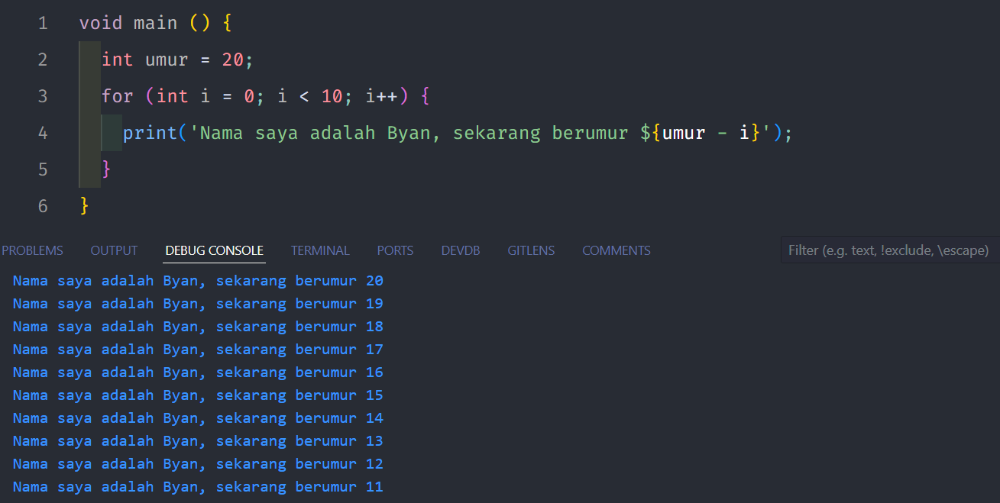

# Pengantar Bahasa Pemrograman Dart - Bagian 1

## Tugas Praktikum

### Soal 1.

### Soal 2.

### Mengapa sangat penting untuk memahami bahasa pemrograman Dart sebelum kita menggunakan framework Flutter ? Jelaskan!

**Jawab** : Karena Dart adalah bahasa utama dalam framework Flutter, dengan memahami Dart memungkinkan untuk memanfaatkan semua fitur Flutter yang tersedia sehingga dengan memanfaatkannya secara efektif dan dapat meningkatkan fungsionalitas aplikasi.

### Soal 3.

### Rangkumlah materi dari codelab ini menjadi poin-poin penting yang dapat Anda gunakan untuk membantu proses pengembangan aplikasi mobile menggunakan framework Flutter.

**Jawab** :

-   **Sintaks Dart** : Mirip dengan C dan JavaScript.
-   **OOP** : Mendukung encapsulation, inheritance, composition, abstraction, dan polymorphism.
-   **Operator** : Operator di Dart adalah metode dalam class.
-   **Operator Aritmatika** : Menyediakan operator standar (+, -, \*, /).
-   **Increment/Decrement** : Mendukung operator (++) dan (--) untuk manipulasi nilai variabel.
-   **Kesetaraan dan Relasional** : Menggunakan == dan != untuk kesetaraan, serta >, <, >=, <= untuk perbandingan.
-   **Operator Logika** : Operator (!, ||, &&) digunakan untuk evaluasi kondisi boolean.
