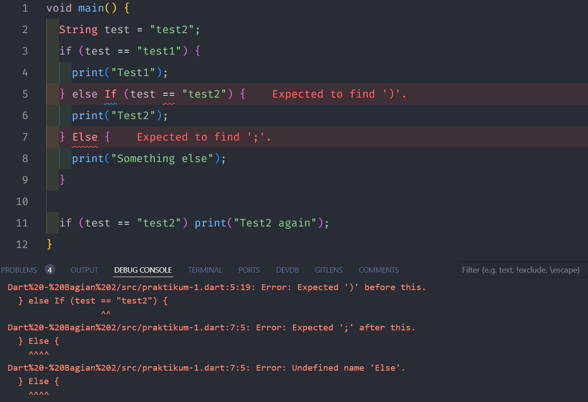

# Pengantar Bahasa Pemrograman Dart - Bagian 2

## Tugas Praktikum

### Soal 1.
* ### Praktikum 1
    *   Langkah 1
    

    *   Langkah 2

        Terdapat error pada pada penulisan else if dan else yang seharusnya diawali tanpa huruf kapital.
    *   Langkah 3
    
        Teradapat error pada variabel test yang sebelumnya telah dideklarasikan, dan pada if tidak dijelaskan dalam kondisi apa program akan berjalan.
    
    *   **Fix Praktikum 1**
    

* ### Praktikum 2
    *   Langkah 1
    

    *   Langkah 2
        
        Terdapat error dikarenakan variabel counter belum terdeklarasi.
    *   Langkah 3
    
    Program akan melakukan print hingga variabel counter mancapai 76.

* ### Praktikum 3
    *   Langkah 1
    

    *   Langkah 2
        
        Terdapat error dikarenakan variabel index belum deklarikan dan pendeklarasian variabel harus diawali dengan huruf kecil, dan kesalahan pada looping variabel index tidak ada update (increment/decrement) sehingga program akan terus berjalan.
    *   Langkah 3
    
        Terdapat error pada pada penulisan if dan else if yang seharusnya diawali tanpa huruf kapital, dan kesalahan pada penulisan variabel index.
    
    *   **Fix Praktikum 3**
    

### Soal 2.

### Buatlah sebuah program yang dapat menampilkan bilangan prima dari angka 0 sampai 201 menggunakan Dart. Ketika bilangan prima ditemukan, maka tampilkan nama lengkap dan NIM Anda.

**Jawab** : 
