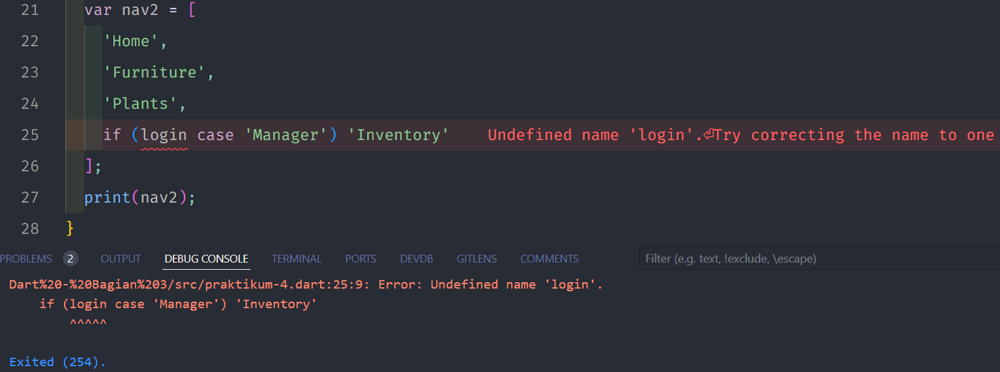

# Pengantar Bahasa Pemrograman Dart - Bagian 3

## Tugas Praktikum

### Soal 1.

-   ### Praktikum 1

    -   Langkah 1
        

    -   Langkah 2

        Kode diatas mendemonstrasikan tentang penggunaan kondisi assert, dimana terdapat kondisi pengecekan apakah panjang list = 3 dan isi list sama dengan 2, jika memenuhi kondisi assert maka program akan berjalan jika tidak memenuhi kondisi assert maka program akan error.

    -   Langkah 3
        
        Program berjalan sesuai dengan nilai default dan untuk list ke 1, dan 2 sesuai dengan nama dan nim saya.

-   ### Praktikum 2

    -   Langkah 1
        

    -   Langkah 2

        Kode diatas menampilkan isi dari set halogens sesuai dengan nilai yang sudah dideklarasikan.

    -   Langkah 3
        
        Program akan menampilkan isi dari set halogens, dan names1, names2, names3 yang masih kosong.

    -   **Fix Praktikum 2**
        
        Program akan menampilkan isi set halogens, names1, names2 sesuai dengan isi yang telah diisikan dengan fungsi add(), dan addAll().

-   ### Praktikum 3

    -   Langkah 1
        

    -   Langkah 2

        Kode diatas mendemonstrasikan tentang penggunaan map untuk menyimpan pasangan key dan value, dan key dalam map dapat berupa string atau angka.

    -   Langkah 3
        
        Kode dapat berjalan akan tetapi variabel yang diprint bukanlah mhs1 dan mhs2, akan tetapi variabel gifts dan nobleGases. Dan penulisan kode pada objek map terdapat kesalahan, sehingga jika diprint akan menampilkan value kosong.

    -   **Fix Praktikum 3**
        
        Program akan menampilkan objek map dari gifts, noblegases, mh1 dan mhs2.

-   ### Praktikum 4

    -   Langkah 1
        

    -   Langkah 2

        Terdapat error karena variabel list1 belum terdeklarasi, hanya terdapat variabel list dan list2.

    -   Langkah 3
        
        Terdapat error karena nilai null tidak dapat dimasukkan dalam list dengan tipe data int.
        

    -   Langkah 4
        
        Terdapat error karena variabel promoActive belum terdeklarasi.

        Hasil promoActive = True:
        
        Hasil promoActive = False:
        

    -   Langkah 5
        
        Terdapat error karena variabel login belum terdeklarasi.

        Hasil login = 'Manager':
        
        Hasil login = 'Admin':
        

    -   Langkah 6
        
        Dalam listOfInts setiap nilai diubah menjadi '#i' sehingga listOfStrings berisikan ['#0', '#1', '#2', '#3'].

        Manfaat penggunaan collection for :

        -   Sintaks Ringkas
        -   Mengurangi Kode
        -   Transformasi Langsung

-   ### Praktikum 5

    -   Langkah 1
        

    -   Langkah 2

        Kode diatas akan mengeprint nilai dari variabel records akan tetapi dalam proses pengeprintnan Dart melakukan pengurutan tuple dengan cara yang memisahkan elemen biasa dari parameter bernama.

    -   Langkah 3
        
        Kode diatas untuk menukarakan nilai pada variabel record, namun karena tidak memenuhi harus mengubah nilai pada variabel record.
        

    -   Langkah 4
        
        Terdapat error karena variaabel mahasiswa belum terdeklarasi, setelah dideklarasikan menghasilkan output seperti berikut.
        
    -   Langkah 5
        
        Kode diatas akan mengeprint variabel mahasiswa2 secara berurutan dengan perintah print.
        

### Soal 2.

### Jelaskan yang dimaksud Functions dalam bahasa Dart!

**Jawab** : Functions dalam Dart adalah blok kode yang dapat dieksekusi dan dapat menerima input (parameter) serta mengembalikan output (nilai).

### Soal 3.

### Jelaskan jenis-jenis parameter di Functions beserta contoh sintaksnya!

**Jawab** :

-   Parameter Posisi :
    ```
    void greet(String name) {
        print('Hello, $name!');
    }
    ```
-   Parameter Opsional :

    ```
    void greet(String name, [String title]) {
        print('Hello, $title $name!');
    }
    ```

-   Parameter Bernama :
    ```
    void greet({String title, String name}) {
        print('Hello, $title $name!');
    }
    ```

### Soal 4.

### Jelaskan maksud Functions sebagai first-class objects beserta contoh sintaknya!

**Jawab** : Functions first-class objects, adalah functions yang dapat disimpan dalam variabel, diteruskan sebagai argumen, dan dikembalikan dari fungsi lain.

```
void main() {
    var myFunction = () => print('Hello!');
    myFunction();
}
```

### Soal 5.

### Apa itu Anonymous Functions? Jelaskan dan berikan contohnya!

**Jawab** : Anonymous functions adalah fungsi yang tidak memiliki nama dan sering digunakan sebagai parameter untuk fungsi lain atau dalam ekspresi.

```
var list = [1, 2, 3];
list.forEach((item) => print(item));
```

### Soal 6.

### Jelaskan perbedaan Lexical scope dan Lexical closures! Berikan contohnya!

**Jawab** :

-   Lexical Scope: Merujuk pada variabel dideklarasikan, fungsi dapat mengakses variabel yang dideklarasikan di dalam scope-nya.

    ```
    void outer() {
        var x = 10;
        void inner() {
            print(x); // Mengakses x dari outer scope
        }
        inner();
    }
    ```

-   Lexical Closures: Adalah fungsi yang "menangkap" variabel dari scope di mana ia didefinisikan, bahkan setelah scope tersebut selesai dieksekusi.
    ```
    Function makeCounter() {
        var count = 0;
        return () => count++; // Menangkap count
    }
    ```

### Soal 7.

### Jelaskan dengan contoh cara membuat return multiple value di Functions!

**Jawab** :
```
(List<int>, int) getValues() {
    return ([1, 2, 3], 42);
}

void main() {
    var (list, number) = getValues();
    print('List: $list, Number: $number');
}
```
